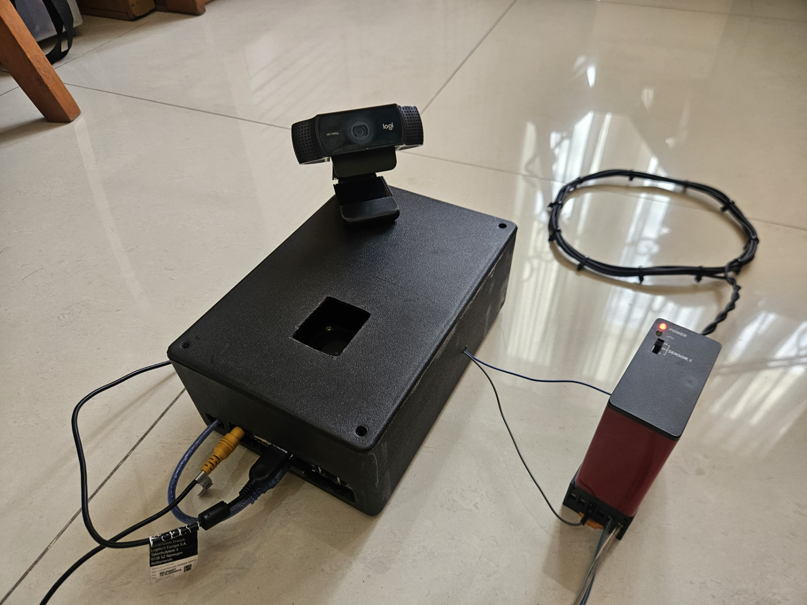
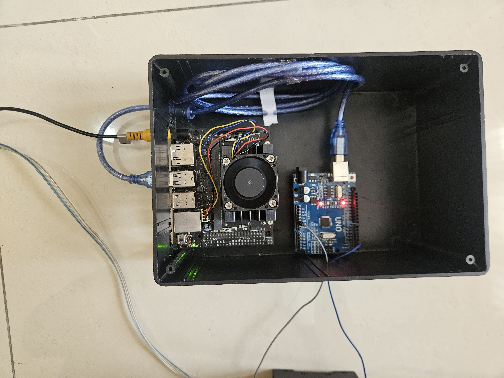

# License Plate Recognition System using Jetson Nano with Computer Vision and OCR
## Description
This project is a smart license plate detection and recognition system using Jetson Nano, Vehicle Loop Detector, and a USB Webcam. In this project, I use NoMachine to share the screen of the Jetson Nano on my laptop (which is what the USB Wi-Fi adapter is for). However, it will also work if connected to a monitor or TV.
 

I will be using Faster R-CNN for license plate detection, PaddleOCR for text extraction from the plate, and Vehicle Loop Detector for vehicle detection.
## Components
**MicroComputer**  
- NVIDIA Jetson Nano 4GB 

**Microcontroller**
- Arduino UNO 

**Sensors**

- Vehicle Loop Detector (/w atleast a 3 meter coil cable) *I use a 2x1 loop

**Others**  

- USB Webcam (I use Logitech C922 for this project but it should work with most webcam)
- Wi-Fi USB
## Pin Layouts

## Documentation
**Photos**   
 
 

**Video**  

https://github.com/user-attachments/assets/58235cc1-261f-4766-a8c4-3d316525e1dd

